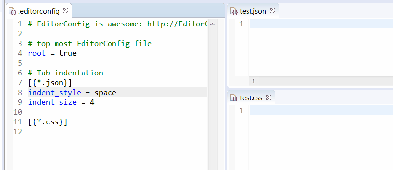
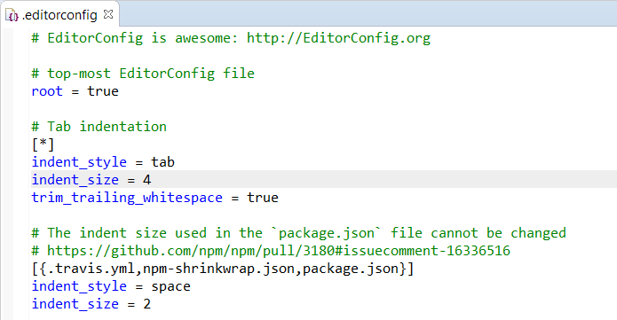

# ec4e

`ec4e` is the [EditorConfig](http://editorconfig.org/) support for Eclipse which works only with `GenericEditor`:

 

`ec4e` provides :

 * an editor for `.editorconfig` based [tm4e](https://github.com/eclipse/tm4e/) and `GenericEditor`:
 
 
 
 * apply config of `.editorconfig` only for `GenericEditor`. Supported properties are:
 
   * `indent_style` 
   * `indent_size`

Syntax coloration, auto close brackets are available for other files (properties/ini files) like .gitattributes, .gitconfig, gitconfig etc

# Similar project

[editorconfig-eclipse](https://github.com/ncjones/editorconfig-eclipse) is an Eclipse plugin for editorconfig, so why developping an another plugin:

 * uses GenericEditor and tm4e for the EditorConfig editor.
 * use a custom parser for editorconfig instead of using standard [editorconfig-core-java](https://github.com/editorconfig/editorconfig-core-java/). This custom parser is able to validate editorconfig, manage completion, etc.
 * apply of editorconfig for a given editor uses IPreferenceStore instead of updating global preferences of Eclipse as soon as editor has focus.